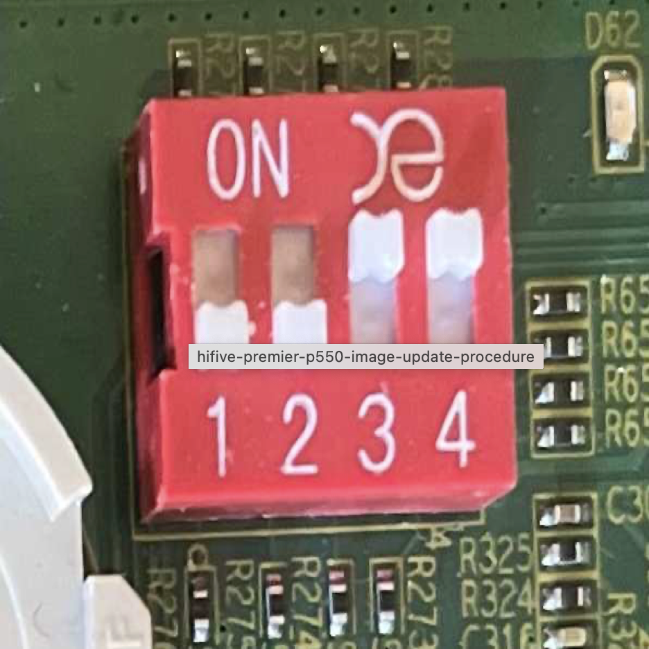
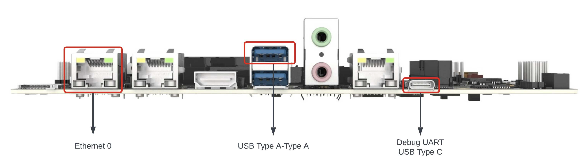

## Documentation

[Board documentation](https://www.sifive.com/boards/hifive-premier-p550)
[Miralis repository](https://github.com/CharlyCst/miralis)

## Step 1: Build an image for the premier P550 board

To build the original image of the board, you need to execute the script ```install.sh``` that will build the image (according to the [software maual](https://www.sifive.com/document-file/hifive-premier-p550-software-reference-manual))

```bash
./install.sh
```

## (alternative) Step 1: Download the image directly

This is as simple as a this: 

```bash
TODO: Add the command
```

## Step 2: Flashing the image on the board with USB

- Place the boot pins at the position ```0011```
- Connect the board with the ATX power supply and the usb-C and usb-A cables (according to the figure) to your computer
- Start minicom with a baudrate of ```11250``` and ```/dev/ttyUSB2```
- Power on the board, a usb device should be enumerated on your computer.
- Copy the bootchain image and wait the output on the UART.
  Typically `cp my_image.bin /run/media/ESWIN-2030/`, although path might changes.

  Note that on MacOS copying the image does not work as expected, a Linux machine is recommended.

<center>
<h3>Switches position</h3>


<h3>Cables to connect</h3>

</center>


## Building a Miralis Image

To build a Miralis image for the HiFive Premier P550 first install the Miralis repository, then create an image for the P550: 

```sh
just build config/premierp550.toml
```

Follow the instructions in [install.sh](./install.sh) to build the u-boot SPL, OpenSBI, and u-boot proper images.

The next step is to build an image containing the P550 firmware plus Miralis.
We place Miralis at `0x80080000` in between the OpenSBI (at `0x80000000`) and u-boot proper (at `0x80200000`).
To do so we create a new file, and the `fw_payload.bin` OpenSBI image to it.
That image contains both OpenSBI and u-boot proper, which a gap filled with zeroes in between.
Then we fill the gap with Miralis.

Here a script to automate the process, remember to change the path:

```sh
#!/bin/bash

MIRALIS_PATH=/Users/charlycst/Documents/projects/miralis/target/riscv-unknown-miralis/debug/miralis.img

# Create a new empty file (removing an existing one, if any)
touch combined.bin
rm combined.bin
touch combined.bin

# Load OpenSBI + u-boot, and then put Miralis in between
dd if=fw_payload.bin of=combined.bin bs=$(printf "%d" 0x1000) seek=0x0 conv=notrunc
dd if=$MIRALIS_PATH of=combined.bin bs=$(printf "%d" 0x1000) seek=$(printf "%d" 0x80) conv=notrunc
```

The newly built `combined.bin` now contains OpenSBI, Mialis, and u-boot.
The image can then be prepare for uploading using `nsign` with the [`miralis.cfg`](./miralis.cfg) configuration.
This configuration simply changes the entry point to Miralis and accepts the `combined.bin` file rather than `fw_payload.bin`.

## Troubleshooting

#### I receive the message USB bulk complete with a negative number

This is completely normal and is part of the copy procedure. If it doesn't work as expected this is probably not the issue.

#### When I copy the image, the DDR firmware starts but then there is no boot 

Your boot image might be broken, try with the original one you can download here: A carefule user will note that the start uart is also not the typical one such as in qemu.

